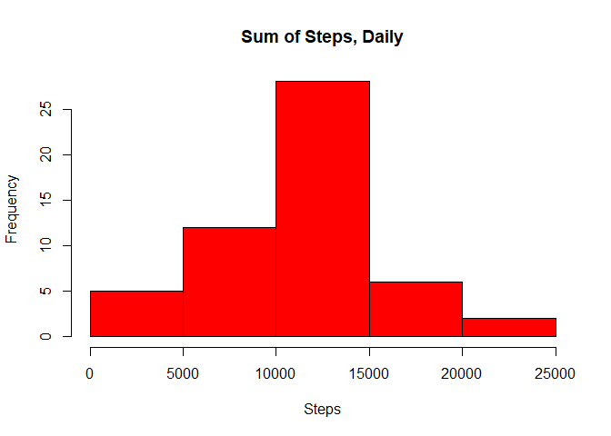
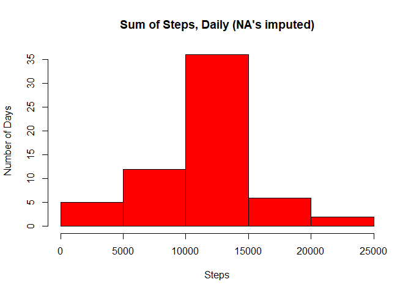
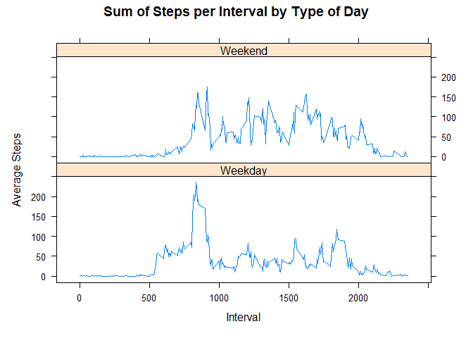

## Loading and preprocessing the data

1. Load the data (i.e. read.csv())

```r
setwd(
        "~/Coursera/Johns_Hopkins_R/4_exploratory_data_analysis/week1/RepData_PeerAssessment1/activity"
)
raw <- read.csv("activity.csv")
setwd(
        "~/Coursera/Johns_Hopkins_R/4_exploratory_data_analysis/week1/RepData_PeerAssessment1"
)
head(raw)
```

```
##   steps       date interval
## 1    NA 2012-10-01        0
## 2    NA 2012-10-01        5
## 3    NA 2012-10-01       10
## 4    NA 2012-10-01       15
## 5    NA 2012-10-01       20
## 6    NA 2012-10-01       25
```

2. Process/transform the data (if necessary) into a format suitable for your analysis
This step has been completed.

## What is mean total number of steps taken per day?

1. Calculate the total number of steps taken per day

```r
steps.perday <- aggregate(raw$steps, list(raw$date), FUN = sum)
colnames(steps.perday) <- c("date", "sum_steps")
head(steps.perday)
```

```
##         date sum_steps
## 1 2012-10-01        NA
## 2 2012-10-02       126
## 3 2012-10-03     11352
## 4 2012-10-04     12116
## 5 2012-10-05     13294
## 6 2012-10-06     15420
```

2.If you do not understand the difference between a histogram and a barplot, research the difference between them. Make a histogram of the total number of steps taken each day

```r
steps.perday.hist <-
        hist(
                steps.perday$sum_steps,
                xlab = "Steps",
                main = "Sum of Steps, Daily",
                col = "red"
        )
```

<!-- -->

3. Calculate and report the mean and median of the total number of steps taken per day

```r
steps.perday.summary <- summary(steps.perday$sum_steps)
steps.perday.meanmedian <- steps.perday.summary[3:4]
steps.perday.meanmedian
```

```
##   Median     Mean 
## 10765.00 10766.19
```

## What is the average daily activity pattern?

1. Make a time series plot (i.e. type= “𝚕”) of the 5-minute interval (x-axis) and the average number of steps taken, averaged across all days (y-axis)

```r
interval.avgsteps <- aggregate(raw$steps ~ raw$interval, raw, mean)
colnames(interval.avgsteps) <- c("interval", "steps")
timeseries <- with(interval.avgsteps,
                   plot(interval, steps, type = "l"))
```

<!-- -->

2. Which 5-minute interval, on average across all the days in the dataset, contains the maximum number of steps?

```r
maxstepsint <- with(interval.avgsteps,
                    interval[which.max(steps)])
maxstepsint
```

```
## [1] 835
```

## Imputing missing values

1. Calculate and report the total number of missing values in the dataset (i.e. the total number of rows with 
NAs)

```r
sum.na <- sum(is.na(raw))
sum.na
```

```
## [1] 2304
```

2. Devise a strategy for filling in all of the missing values in the dataset. The strategy does not need to be sophisticated. For example, you could use the mean/median for that day, or the mean for that 5-minute interval, etc.

My method: NA's will be populated with the mean for that day. Days that have mean = NA will be populated with the mean of all days.

```r
mean.perday <- aggregate(raw$steps, list(raw$date), FUN = mean)
mean.alldays <- mean(mean.perday$x, na.rm = TRUE)
for (i in 1:length(mean.perday$x)) {
        if (is.na(mean.perday$x[i])) {
                mean.perday$x[i] = mean.alldays
        }
}
raw.nafill <- raw
for (i in 1:length(raw.nafill$steps)) {
        if (is.na(raw.nafill$steps[i])) {
                raw.nafill$steps[i] = subset(mean.perday$x,
                                             mean.perday$Group.1 == raw.nafill$date[i])
        }
}
```

3. Create a new dataset that is equal to the original dataset but with the missing data filled in.

These steps have been completed above. See the head of the new dataset below.

```r
head(raw.nafill)
```

```
##     steps       date interval
## 1 37.3826 2012-10-01        0
## 2 37.3826 2012-10-01        5
## 3 37.3826 2012-10-01       10
## 4 37.3826 2012-10-01       15
## 5 37.3826 2012-10-01       20
## 6 37.3826 2012-10-01       25
```

4. Make a histogram of the total number of steps taken each day and Calculate and report the mean and median total number of steps taken per day. Do these values differ from the estimates from the first part of the assignment? What is the impact of imputing missing data on the estimates of the total daily number of steps?

```r
sumsteps.nafill <-
        aggregate(raw.nafill$steps ~ raw.nafill$date, raw.nafill, sum)
colnames(sumsteps.nafill) <- c("date", "steps")
nafill.stepsperday.hist <-
        hist(
                sumsteps.nafill$steps,
                xlab = "Steps",
                ylab = "Number of Days",
                main = "Sum of Steps, Daily (NA's imputed)",
                col = "red"
        )
```

<!-- -->

Now we report the mean and median.

```r
nafill.mean <- mean(sumsteps.nafill$steps)
nafill.median <- median(sumsteps.nafill$steps)
nafill.mean
```

```
## [1] 10766.19
```

```r
nafill.median
```

```
## [1] 10766.19
```

The interpolation of NA values did not have a significant impact on the mean and median values - compared to the mean and median values discussed in Q1.3, there is only a minor difference in the median values. Obviously, the median and mean values are identical in this case.

## Are there differences in activity patterns between weekdays and weekends?

1.Create a new factor variable in the dataset with two levels – “weekday” and “weekend” indicating whether a given date is a weekday or weekend day.

```r
raw$date <- as.Date(strptime(raw$date, format = "%Y-%m-%d"))
for (i in 1:length(raw$date)) {
        if (weekdays(raw$date[i]) == "Saturday" |
            weekdays(raw$date[i]) == "Sunday") {
                raw$day_wkday_wkend[i] <- "Weekend"
        } else {
                raw$day_wkday_wkend[i] <- "Weekday"
        }
}
raw$day_wkday_wkend <- as.factor(raw$day_wkday_wkend)
head(raw)
```

```
##   steps       date interval day_wkday_wkend
## 1    NA 2012-10-01        0         Weekday
## 2    NA 2012-10-01        5         Weekday
## 3    NA 2012-10-01       10         Weekday
## 4    NA 2012-10-01       15         Weekday
## 5    NA 2012-10-01       20         Weekday
## 6    NA 2012-10-01       25         Weekday
```

2. Make a panel plot containing a time series plot (i.e. 𝚝𝚢𝚙𝚎 = “𝚕”) of the 5-minute interval (x-axis) and the average number of steps taken, averaged across all weekday days or weekend days (y-axis). See the README file in the GitHub repository to see an example of what this plot should look like using simulated data.

```r
bydaytype <-
        aggregate(steps ~ interval + day_wkday_wkend, raw, mean, na.rm = T)

library(lattice)
with(
        bydaytype,
        xyplot(
                steps ~ interval | day_wkday_wkend,
                type = "l",
                layout = c(1:2),
                main = "Sum of Steps per Interval by Type of Day",
                xlab = "Interval",
                ylab = "Average Steps"
        )
)
```

<!-- -->


